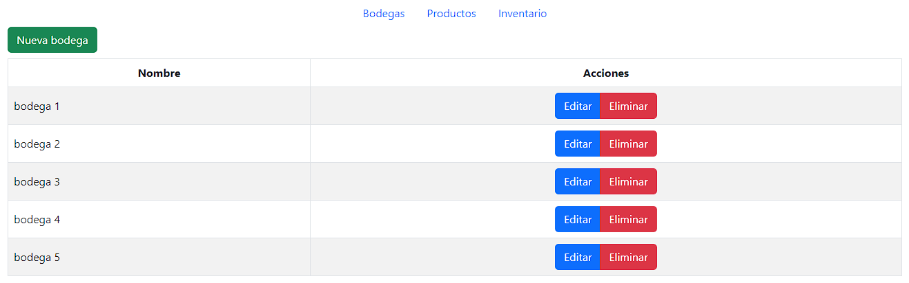
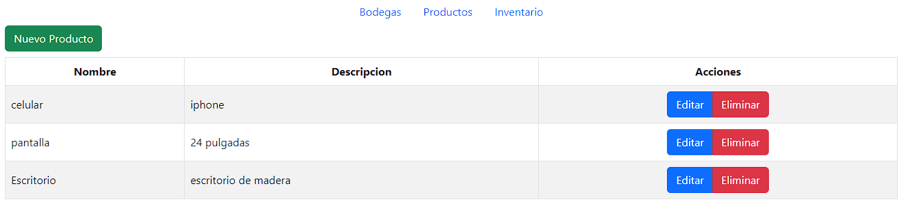
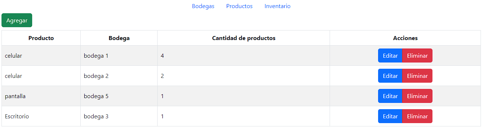

# CRUD de productos y bodegas

Este proyecto es un CRUD(cada entidad se podra crear,vizualizar,actualizar y eliminar) con php(PDO) en el cual se tienen diferentes productos que pueden estar en diferentes bodegas, la relacion entre las entidades sera el inventario.
- Bodegas

- Productos
  
  
- Inventario
  
  
## Tecnologías utilizadas

El proyecto se creo utilizand vanilla JavaScript y PHP, se utilizo una dependenci apara las variables de entorno 'vlucas/phpdotenv'.

## Backend 

En el backend se crea una Api-Rest para las diferentes peticiones generadas por el frontend, ademas del modelo que cnecta con la base de datos que se realizo con MySql.

## Frontend

Se utilizo vanilla javascript en conjunto con BootStrap para el estilado de la pagina.

## Requisitos previos

Antes de instalar y utilizar este proyecto, asegúrate de tener instalado MySql en tu equipo. También deberás crear la base de datos y las tablas necesarias para el proyecto. Puedes encontrar el código SQL para crear la base de datos y las tablas en el archivo DB.sql del directorio raíz del proyecto.

## Instalacíon

Para instalar este proyecto en tu equipo local, sigue estos pasos:
1. Clona este repositorio en tu equipo local.
2. Navega hasta el directorio del proyecto y ejecuta `composer install` para instalar todas las dependencias.
3. Crea un archivo `.env` en el directorio raiz y agrega tus variables de entorno.
    - Las variables de entorno para la conexion a la base de datos son:
        - host
        - dbname
        - username
        - password
4. Crea una base de datos en MySql donde se tenga bodegas, productos e inventario(esta configuracion ya esta en el archivo DB.sql de la raiz del proyecto), donde una bodega puede tener muchos productos y un producto puede estar en muchas bodegas(relación n:n)
5. Puedes ejecutar `php -S localhost:8080` para iniciar el servidor.
